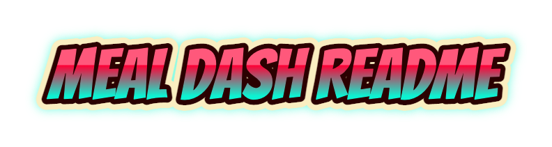

<!-- PROJECT LOGO -->
 

  

  <h3 align="center"></h3>

  

    Your everyday READEME file for the Meal Dash project.
     
    <a href="https://github.com/swapsmax/mealdash"><strong>Explore the files »</strong></a>
     
     
    ·
    <a href="https://github.com/swapsmax/meal-dash">Report Bug (coming soon)</a>
    ·
    <a href="https://github.com/swapsmax/meal-dash">Request Feature (coming soon)</a>
  

 
 

<!-- TABLE OF CONTENTS -->

  
Table of Contents

  <ol>
    <li>
      <a href="#about-the-project">About The Project</a>
      <ul>
        <li><a href="#built-with">Built With</a></li>
      </ul>
    </li>
    <li>
      <a href="#getting-started">Getting Started</a>
      <ul>
        <li><a href="#prerequisites">Prerequisites</a></li>
        <li><a href="#installation">Installation</a></li>
      </ul>
    </li>
    <li><a href="#usage">Usage</a></li>
    <li><a href="#roadmap">Roadmap</a></li>
    <li><a href="#contributing">Contributing</a></li>
    <li><a href="#contact">Contact</a></li>
  </ol>

 
 

<!-- ABOUT THE PROJECT -->
## About The Project

 
 

Meal Dash is a food ordering web application.

(<a href="#top">back to top</a>)

### Built With (TO BE UPDARED)

Here is a list of major frameworks/libraries and softwares used in the development of the game.

* [Firebase](https://firebase.google.com/)

(<a href="#top">back to top</a>)

<!-- GETTING STARTED -->
## Getting Started

To get a local copy up and running follow these simple example steps.

### Prerequisites

This web app is compatible with Windows and MacOS. 
Run it on Google Chrome for best compatibility.

### Installation (TO BE UPDATED)

Click on --- to open the web app in a new tab.

(<a href="#top">back to top</a>)

<!-- USAGE EXAMPLES -->
## Usage (TO BE UPDATED)

This web app allows users to order food by adding it to the cart.

(<a href="#top">back to top</a>)

<!-- ROADMAP -->
## Roadmap

- [x] Wireframing.
- [x] HTML/CSS front-end development.
- [x] Back-end development.

See the project report for a full list of proposed features (and known issues).

(<a href="#top">back to top</a>)

<!-- CONTRIBUTING -->
## Contributing

Contributions are what make a project an amazing opportunity to learn, inspire, and create. All contributions of the group members are greatly appreciated.

If you have a suggestion that would make this better, please fork the repo and create a pull request. You can also simply open an issue with the tag "enhancement".
Don't forget to give the project a star! Thanks again!

1. Fork the Project
2. Create your Feature Branch (`git checkout -b feature/AmazingFeature`)
3. Commit your Changes (`git commit -m 'Add some AmazingFeature'`)
4. Push to the Branch (`git push origin feature/AmazingFeature`)
5. Open a Pull Request

(<a href="#top">back to top</a>)

<!-- CONTACT -->
## Contact

This project waas created by the following group of individuals - Swapnil and Jessie - for the 'Web Application Design' module in Nanyang Technological University (NTU).

Project Link: [https://github.com/swapsmax/meal-dash](https://github.com/swapsmax/meal-dash)

(<a href="#top">back to top</a>)

<!-- MARKDOWN LINKS & IMAGES -->
[product-screenshot]: images/screenshot.png

© 2022 Swapnil Bapat

